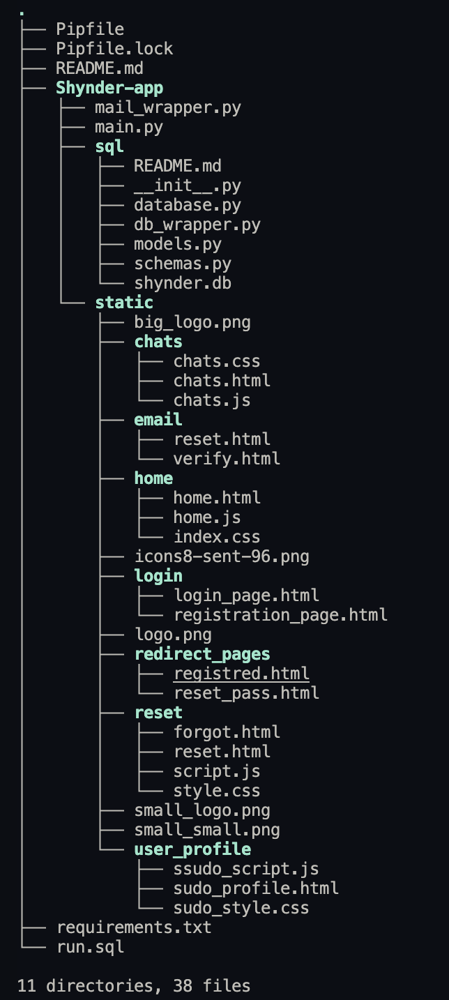
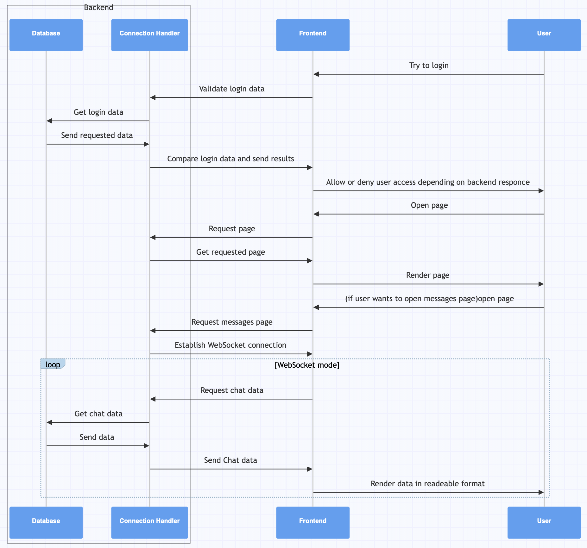

# Shynder-website   

This is repository for the Shynder website. 
It is built using FastAPI.

## File structure

## Architecture
Workflow:

## API Endpoints
- `/`: Login page
- '/login/': login user, returns session id. Query parameters: `username`, `password`
- '/logout/': logout user, returns session id. Query parameters: `session_id`
- '/register/': register user, sends email with verification link. Query parameters: `username`, `password`, `email`, `full_name`, `test_answers` 
- '/verify/': verify user email. Query parameters: `token`
- '/profile/': get user profile. Query parameters: `session_id`
- '/home': home page.
- `/get_avtive_user/`: get active user. Query parameters: `session_id`
- `/update_user/`: update user profile. Query parameters: `session_id`, `username`, `password`, `full_name`, `test_answers`
- `/delete_user/`: delete user. Query parameters: `session_id`
- `/get_all_active_users/`: get all active users.
- `/get_user_by_email/`: get user. Query parameters: `email`
- `/chats_page/`: get chats page.
- `/forgot_password/`: forgot password. Query parameters: `email`
- `/reset_password/`: reset password. Query parameters: `token`
- `/change_password/`: change password. Query parameters: `token`, `password`
- `/gen_matches/`: generate matches. Query parameters: `session_id`
- `/match/`: match users. Query parameters: `user1_id`, `user2_id`
- `/chats_websocket/`: websocket for chats. Query parameters: `session_id`
- `/get_match/`: get match. Query parameters: `match_id`
- `/get_user_by_id/`: get user by id. Query parameters: `user_id`
- `/swipe_left/`: swipe left. Query parameters: `session_id`, `user_id`
- `/swipe_right/`: swipe right. Query parameters: `session_id`, `user_id`